# I-FGSM Adversarial Attack — Image Classifier

Implementation of **FGSM** and **I-FGSM (Iterative Fast Gradient Sign Method)** adversarial attacks on image classifiers, supporting **MNIST**, **CIFAR-10**, and **ImageNette** (pretrained ResNet-18 & MobileNetV2), with full training, evaluation, visualization pipelines, and a **cross-architecture transfer attack experiment** across SimpleCNN, ResNet-18, and MobileNetV2.

> Paper: *Adversarial Examples in the Physical World* — Kurakin, Goodfellow & Bengio (2016)
> https://arxiv.org/abs/1607.02533


---

## Table of Contents

- [What is I-FGSM?](#what-is-i-fgsm)
- [Evaluation Methodology](#evaluation-methodology)
- [Project Structure](#project-structure)
- [Setup](#setup)
- [Datasets](#datasets)
- [Models](#models)
- [Usage](#usage)
- [Attack API](#attack-api)
- [Training](#training)
- [Experiments](#experiments)
- [Experiment Results](#experiment-results)
- [Configuration](#configuration)
- [Testing](#testing)
- [References](#references)

---

## Quick Results

| | MNIST | CIFAR-10 (SimpleCNN) | CIFAR-10 Transfer (ε=0.20) |
|---|---|---|---|
| Clean accuracy | 99.45% | 76.02% | — |
| FGSM ASR (ε=0.20) | 74.7% | 84.2% | 64–76% (black-box) |
| I-FGSM ASR (ε=0.20) | 100.0% | 98.9% | 67–90% (black-box) |
| Steps to converge | ~40 | ~5 | — |

---

## What is I-FGSM?

**FGSM** (Goodfellow et al., 2015) crafts adversarial examples in a single gradient step:

```
x_adv = x + ε · sign(∇ₓ J(θ, x, y))
```

**I-FGSM** (also known as **BIM — Basic Iterative Method**) extends this by taking many small steps, clipping the perturbation after each one to stay within the ε-ball:

```
x₀    = x
xₜ₊₁ = Clip_{x,ε} [ xₜ + α · sign(∇ₓ J(θ, xₜ, y)) ]
```

| Symbol | Meaning |
|---|---|
| `ε` | Maximum L∞ perturbation magnitude |
| `α` | Step size per iteration (default: `ε / T`) |
| `T` | Number of iterations |
| `Clip_{x,ε}` | Keeps perturbation in `[-ε, +ε]` and pixels in valid normalized range |

**Why is I-FGSM stronger than FGSM?**

FGSM takes a single large step and often overshoots. I-FGSM refines the adversarial direction iteratively — each step re-computes the gradient from the current (already adversarial) image, finding a much more targeted direction. At the same ε budget, I-FGSM is dramatically more effective.

**PGD variant:** setting `random_start=True` initializes the perturbation with uniform noise in `[-ε, +ε]` before iterating, turning I-FGSM into the **PGD attack** (Madry et al., 2018).

---

## Evaluation Methodology

All experiments follow a strict **2-phase evaluation** to measure attack effectiveness fairly:

```
Phase 1 — Predict & Filter
  Feed entire test set through the model (no attack)
  → Record clean accuracy and n_correct
  → Keep only the samples the model predicted CORRECTLY

Phase 2 — Attack
  Run FGSM and I-FGSM only on the correctly classified samples
  → Measure robust accuracy, ASR, perturbation size, and attack time
  → Report absolute accuracy over the full test set
```

**Why attack only correctly classified samples?**

Attacking misclassified samples is meaningless — they are already wrong. This methodology isolates the true attack strength: *of the examples the model gets right, how many can be fooled?*

**Metrics reported for each experiment:**

| Metric | Description |
|---|---|
| `clean_acc` | Baseline accuracy before any attack (%) |
| `fgsm_acc` / `ifgsm_acc` | Accuracy remaining after attack, over full test set (%) |
| `fgsm_asr` / `ifgsm_asr` | **Attack Success Rate** — % of correctly classified samples that were fooled |
| `fgsm_drop` / `ifgsm_drop` | Absolute accuracy drop in percentage points |
| `perturbation_linf` | Max L∞ perturbation magnitude (should equal ε) |
| `perturbation_l2` | Mean L2 perturbation norm across the batch |
| `fgsm_time_s` / `ifgsm_time_s` | Wall-clock time of the attack in seconds |

---

## Project Structure

```
ifgsm_project/
│
├── attacks/
│   ├── fgsm.py               # FGSM (1-step): class-based + functional API
│   └── ifgsm.py              # I-FGSM: class-based + functional API
│                             # Both support per-channel tensor clip (ImageNette)
│
├── models/
│   ├── cnn.py                # SimpleCNN — auto-adapts arch to MNIST / CIFAR-10
│   ├── resnet.py             # ResNet-18: small-image (scratch) + ImageNette (pretrained)
│   ├── mobilenet.py          # MobileNetV2: pretrained ImageNet, fine-tune for ImageNette
│   └── __init__.py           # Exports: SimpleCNN, get_resnet18, get_resnet18_imagenette,
│                             #          get_mobilenetv2_imagenette, get_mobilenetv2_cifar10
│
├── utils/
│   ├── data_loader.py        # MNIST / CIFAR-10 / ImageNette dataloaders + transforms
│   │                         # get_clip_values() → per-channel clip for ImageNette
│   ├── trainer.py            # Training loop: checkpoint saving, tqdm progress, history
│   ├── evaluator.py          # 2-phase adversarial evaluation
│   │                         # Reports: accuracy, ASR, timing, perturbation norms
│   └── visualization.py      # 7 plot types:
│                             #   plot_training_history
│                             #   plot_accuracy_vs_epsilon
│                             #   plot_accuracy_vs_steps
│                             #   plot_adversarial_examples
│                             #   plot_prediction_probs   (softmax bar charts)
│                             #   plot_epsilon_grid       (presentation: ε sweep)
│                             #   plot_steps_grid         (presentation: T sweep)
│
├── experiments/
│   ├── exp1_epsilon.py       # Sweep ε → accuracy + ASR + timing  (FGSM & I-FGSM)
│   ├── exp2_steps.py         # Sweep T → accuracy + ASR           (I-FGSM, steps_epsilon)
│   ├── exp3_visualize.py     # Images + perturbation + prediction probability charts
│   ├── exp4_presentation.py  # Presentation grids: ε-sweep & T-sweep side-by-side
│   └── exp5_transfer.py      # Cross-architecture transfer attack  (CIFAR-10, 3×3 matrix)
│
├── configs/
│   └── config.yaml           # All hyperparameters in one place
│
├── results/
│   ├── checkpoints/          # Model weights (.pth) — one file per dataset+model combo
│   ├── figures/              # Generated plots (.png)
│   └── logs/                 # Experiment metrics (.json)
│
├── tests/
│   └── test_ifgsm.py         # pytest unit tests (CPU, no checkpoint needed)
│
├── train.py                  # Standalone training script
├── main.py                   # Full pipeline: train → exp1 → exp2 → exp3
├── generate_report.py        # Builds BaoCao_FGSM_IFGSM.docx from all experiment results
└── requirements.txt
```

---

## Setup

```bash
# Clone the repo
git clone https://github.com/wotttoo/ifgsm-adversarial-attacks.git
cd ifgsm-adversarial-attacks

# Create a virtual environment (recommended)
python -m venv venv
source venv/bin/activate       # Linux/Mac
# venv\Scripts\activate        # Windows

# Install dependencies
pip install -r requirements.txt
```

**Requirements:** Python 3.10+, PyTorch 2.0+, torchvision, matplotlib, tqdm, pyyaml.

### Download pretrained checkpoints

Model checkpoints are hosted on [GitHub Releases](https://github.com/wotttoo/ifgsm-adversarial-attacks/releases/tag/v1.0) (not included in the repo due to file size).

**Option A — using `gh` CLI:**
```bash
gh release download v1.0 --dir results/checkpoints/
```

**Option B — using `wget`:**
```bash
mkdir -p results/checkpoints
BASE=https://github.com/wotttoo/ifgsm-adversarial-attacks/releases/download/v1.0
wget -P results/checkpoints/ \
  $BASE/mnist_best.pth \
  $BASE/cifar10_best.pth \
  $BASE/cifar10_resnet18_best.pth \
  $BASE/cifar10_mobilenetv2_best.pth \
  $BASE/imagenette_resnet18_best.pth \
  $BASE/imagenette_mobilenetv2_best.pth
```

After downloading, you can skip training and run experiments directly with `--skip-train`.

---

## Datasets

| Dataset | Classes | Image size | Normalization | Source |
|---|---|---|---|---|
| **MNIST** | 10 (digits 0–9) | 28×28, grayscale | `[0, 1]` raw pixel | `torchvision.datasets.MNIST` |
| **CIFAR-10** | 10 (objects) | 32×32, RGB | mean=(0.491, 0.482, 0.447) / std=(0.247, 0.244, 0.262) | `torchvision.datasets.CIFAR10` |
| **ImageNette** | 10 (ImageNet subset) | 224×224, RGB | ImageNet mean=(0.485, 0.456, 0.406) / std=(0.229, 0.224, 0.225) | fastai S3, `ImageFolder` |

### Dataset splits

| Dataset | Train | Val | Test |
|---|---|---|---|
| MNIST | 54,000 | 6,000 | 10,000 |
| CIFAR-10 | 45,000 | 5,000 | 10,000 |
| ImageNette | ~8,522 | ~947 | 3,925 |

### ImageNette — automatic download

ImageNette (~1.5 GB) is **downloaded and extracted automatically** the first time you run any script with `--dataset ImageNette`. Saved under `data/imagenette2-320/` and not re-downloaded on subsequent runs.

```
data/
└── imagenette2-320/
    ├── train/   ← source for train + val split (90/10)
    └── val/     ← used as test set (3,925 images)
```

ImageNette 10 classes:
```
tench · English springer · cassette player · chain saw · church
French horn · garbage truck · gas pump · golf ball · parachute
```

### Per-channel clip values for adversarial attacks

MNIST / CIFAR-10 pixel values sit in `[0, 1]` (scalar bounds). ImageNette images are normalized with ImageNet statistics, so the valid pixel range is **per-channel**:

```python
from utils.data_loader import get_clip_values

clip_min, clip_max = get_clip_values("ImageNette")
# clip_min: tensor([-2.118, -2.036, -1.804])
# clip_max: tensor([ 2.249,  2.429,  2.640])
```

The attack code (`fgsm.py`, `ifgsm.py`) handles both scalar and tensor clip bounds transparently via a `_clip()` helper that broadcasts per-channel bounds to `[B, C, H, W]`. **No manual configuration needed** — `get_clip_values()` is called automatically inside each experiment.

---

## Models

### Model — Dataset compatibility

| Model | MNIST | CIFAR-10 | ImageNette |
|---|---|---|---|
| SimpleCNN | ✓ (default) | ✓ (default) | ✗ (too small for 224×224) |
| ResNet-18 (scratch) | ✓ | ✓ | ✗ |
| ResNet-18 (pretrained) | ✗ | ✗ | ✓ (default) |
| MobileNetV2 (CIFAR-10) | ✗ | ✓ (Exp5) | ✗ |
| MobileNetV2 (pretrained) | ✗ | ✗ | ✓ |

> ResNet-18 (scratch) and MobileNetV2 (CIFAR-10) are used together with SimpleCNN in **Exp 5** to build a 3-model cross-architecture transfer attack matrix.

### SimpleCNN

A compact CNN that auto-scales its architecture based on the input dataset.

**MNIST** (`in_channels=1`, `28×28`):
```
Block 1:  Conv2d(1→32, 3×3) → BN → ReLU → Conv2d(32→32, 3×3) → BN → ReLU
          → MaxPool2d(2×2) → Dropout2d(0.25)
Classifier: Flatten → Linear(6272→512) → ReLU → Dropout(0.5) → Linear(512→10)
```

**CIFAR-10** (`in_channels=3`, `32×32`):
```
Block 1:  Conv2d(3→32, 3×3) → BN → ReLU → Conv2d(32→32, 3×3) → BN → ReLU
          → MaxPool2d(2×2) → Dropout2d(0.25)
Block 2:  Conv2d(32→64, 3×3) → BN → ReLU → Conv2d(64→64, 3×3) → BN → ReLU
          → MaxPool2d(2×2) → Dropout2d(0.25)
Classifier: Flatten → Linear(4096→512) → ReLU → Dropout(0.5) → Linear(512→10)
```

### ResNet-18 (scratch — for MNIST / CIFAR-10)

Standard torchvision ResNet-18 adapted for small images:
- First `Conv2d` replaced with `3×3, stride=1` (avoids aggressive downsampling)
- `maxpool` replaced with `Identity()`
- Final `fc` replaced with `Linear(512 → num_classes)`

```bash
python train.py --dataset MNIST   --model ResNet18
python train.py --dataset CIFAR10 --model ResNet18
```

### ResNet-18 (pretrained — for ImageNette)

- Weights: `ResNet18_Weights.IMAGENET1K_V1` (~11.7M params, ImageNet Top-1: 69.8%)
- Final `fc` replaced with `Linear(512 → 10)`
- Input: 224×224 RGB + ImageNet normalization
- **Default model for ImageNette**

```python
from models import get_resnet18_imagenette
model = get_resnet18_imagenette(num_classes=10)
```

### MobileNetV2 (pretrained — for ImageNette)

- Weights: `MobileNet_V2_Weights.IMAGENET1K_V1` (~3.4M params, ImageNet Top-1: 71.9%)
- `classifier[1]` replaced with `Linear(1280 → 10)`
- Input: 224×224 RGB + ImageNet normalization (same as ResNet-18)
- **Lighter and faster** than ResNet-18, higher ImageNet accuracy

```python
from models import get_mobilenetv2_imagenette
model = get_mobilenetv2_imagenette(num_classes=10)
```

**Comparison: ImageNette models**

| | MobileNetV2 | ResNet-18 |
|---|---|---|
| Parameters | ~3.4M | ~11.7M |
| ImageNet Top-1 | 71.9% | 69.8% |
| Architecture | Inverted residuals + linear bottleneck | Residual blocks |
| Inference speed | Faster | Slower |
| Best for | Speed-constrained deployment | Baseline research |

**Checkpoint filenames:**

| Dataset + Model | Checkpoint file |
|---|---|
| MNIST + SimpleCNN | `results/checkpoints/mnist_best.pth` |
| CIFAR-10 + SimpleCNN | `results/checkpoints/cifar10_best.pth` |
| CIFAR-10 + ResNet-18 | `results/checkpoints/cifar10_resnet18_best.pth` |
| CIFAR-10 + MobileNetV2 | `results/checkpoints/cifar10_mobilenetv2_best.pth` |
| ImageNette + ResNet-18 | `results/checkpoints/imagenette_resnet18_best.pth` |
| ImageNette + MobileNetV2 | `results/checkpoints/imagenette_mobilenetv2_best.pth` |

---

## Usage

### Full pipeline via `main.py`

```bash
# Train + run all 3 experiments on MNIST (default)
python main.py

# Choose dataset
python main.py --dataset MNIST
python main.py --dataset CIFAR10
python main.py --dataset ImageNette                       # ResNet-18 (default)
python main.py --dataset ImageNette --model MobileNetV2   # MobileNetV2
python main.py --dataset both                             # MNIST + CIFAR-10 sequentially

# Skip training (use existing checkpoint)
python main.py --dataset CIFAR10 --skip-train
python main.py --dataset ImageNette --model MobileNetV2 --skip-train

# Run only specific experiments (e.g. 1 and 3)
python main.py --dataset MNIST --skip-train --exp 1 3
python main.py --dataset MNIST --skip-train --exp 4          # presentation grids
python main.py --dataset ImageNette --model MobileNetV2 --skip-train --exp 1 2
```

> `--model` is propagated to both training **and** all experiments, so the correct model and checkpoint are used end-to-end.

### Train only via `train.py`

```bash
python train.py                                          # SimpleCNN on MNIST
python train.py --dataset CIFAR10                        # SimpleCNN on CIFAR-10
python train.py --dataset ImageNette                     # ResNet-18 (pretrained) on ImageNette
python train.py --dataset ImageNette --model MobileNetV2 # MobileNetV2 on ImageNette
python train.py --dataset MNIST --model ResNet18         # ResNet-18 from scratch on MNIST
python train.py --dataset CIFAR10 --epochs 30 --lr 0.0005 --batch 128
```

### Run a single experiment

Run from the **project root** (not from `experiments/`):

```bash
# Exp1 — accuracy & ASR vs epsilon
python -c "from experiments.exp1_epsilon import run; run('configs/config.yaml', dataset='MNIST')"
python -c "from experiments.exp1_epsilon import run; run('configs/config.yaml', dataset='CIFAR10')"
python -c "from experiments.exp1_epsilon import run; run('configs/config.yaml', dataset='ImageNette')"
python -c "from experiments.exp1_epsilon import run; run('configs/config.yaml', dataset='ImageNette', model='MobileNetV2')"

# Exp2 — accuracy & ASR vs number of steps
python -c "from experiments.exp2_steps import run; run('configs/config.yaml', dataset='MNIST')"
python -c "from experiments.exp2_steps import run; run('configs/config.yaml', dataset='ImageNette', model='MobileNetV2')"

# Exp3 — visualization (side-by-side + probability charts + loss curve)
python -c "from experiments.exp3_visualize import run; run('configs/config.yaml', dataset='CIFAR10')"
python -c "from experiments.exp3_visualize import run; run('configs/config.yaml', dataset='ImageNette', model='MobileNetV2')"

# Exp4 — presentation grids (epsilon sweep + steps sweep)
python -c "from experiments.exp4_presentation import run; run('configs/config.yaml', dataset='MNIST')"
python -c "from experiments.exp4_presentation import run; run('configs/config.yaml', dataset='CIFAR10')"
python -c "from experiments.exp4_presentation import run; run('configs/config.yaml', dataset='ImageNette', model='MobileNetV2')"

# Exp5 — cross-architecture transfer attack (CIFAR-10, requires all 3 checkpoints)
python experiments/exp5_transfer.py
```

> **Exp5 prerequisites:** train all three CIFAR-10 models first.
> ```bash
> python train.py --dataset CIFAR10                        # SimpleCNN
> python train.py --dataset CIFAR10 --model ResNet18       # ResNet-18
> python train.py --dataset CIFAR10 --model MobileNetV2    # MobileNetV2
> ```
> Or chain everything in one command:
> ```bash
> python train.py --dataset CIFAR10 && \
> python train.py --dataset CIFAR10 --model ResNet18 && \
> python train.py --dataset CIFAR10 --model MobileNetV2 && \
> python experiments/exp5_transfer.py
> ```

### Run unit tests

```bash
python -m pytest tests/ -v
```

---

## Attack API

### Class-based (recommended)

```python
from attacks.ifgsm import IFGSMAttack
from utils.data_loader import get_clip_values

# MNIST / CIFAR-10 — scalar clip bounds
attacker = IFGSMAttack(
    model        = model,
    epsilon      = 0.3,       # L∞ budget
    num_steps    = 40,        # iterations T
    alpha        = None,      # None → auto = epsilon / num_steps
    targeted     = False,
    random_start = False,     # True → PGD-style random initialization
    clip_min     = 0.0,
    clip_max     = 1.0,
)

# ImageNette — per-channel tensor clip bounds
clip_min, clip_max = get_clip_values("ImageNette")
attacker = IFGSMAttack(
    model     = model,
    epsilon   = 0.05,
    num_steps = 20,
    clip_min  = clip_min,    # tensor([-2.118, -2.036, -1.804])
    clip_max  = clip_max,    # tensor([ 2.249,  2.429,  2.640])
)

adv_images = attacker(images, labels)
adv_images, perturbation = attacker.get_perturbation(images, labels)

# Statistics populated after every call
print(attacker.last_stats)
# {
#   'epsilon': 0.3, 'alpha': 0.0075, 'num_steps': 40,
#   'loss_history': [...],       # cross-entropy loss at each step
#   'final_loss': 4.23,
#   'perturbation_l2': 1.84,     # mean L2 norm of perturbation
#   'perturbation_linf': 0.3,    # max L∞ (should equal epsilon)
# }
```

### Functional API

```python
from attacks.ifgsm import ifgsm_attack
from attacks.fgsm  import fgsm_attack

adv = ifgsm_attack(model, images, labels, epsilon=0.3, num_steps=40)
adv = fgsm_attack(model, images, labels, epsilon=0.3)
```

### Targeted attack

```python
target_labels = torch.full_like(labels, fill_value=3)  # force → class 3
attacker = IFGSMAttack(model, epsilon=0.2, num_steps=40, targeted=True)
adv = attacker(images, target_labels)
```

---

## Training

The `Trainer` class handles the full training loop:

| Feature | Details |
|---|---|
| Loss | Cross-entropy |
| Checkpoint | Saves best model (by val accuracy) to `results/checkpoints/` |
| LR schedule | `StepLR` (step=10, γ=0.1) |
| History | `train_loss`, `train_acc`, `val_loss`, `val_acc` per epoch |
| Progress | `tqdm` per batch |

### MNIST — SimpleCNN

| Setting | Value |
|---|---|
| Split | 54,000 / 6,000 / 10,000 |
| Model | SimpleCNN |
| Optimizer | Adam (lr=0.001, wd=1e-4) |
| Epochs | 20 |
| Batch size | 64 |
| Augmentation | RandomAffine (rotate ±10°, translate 10%) |
| **Val accuracy** | **98.98%** |
| **Test accuracy** | **99.45%** |

### CIFAR-10 — SimpleCNN

| Setting | Value |
|---|---|
| Split | 45,000 / 5,000 / 10,000 |
| Model | SimpleCNN |
| Optimizer | Adam (lr=0.001, wd=1e-4) |
| Epochs | 20 |
| Batch size | 64 |
| Augmentation | RandomCrop(32, padding=4) + RandomHorizontalFlip |
| **Test accuracy** | **76.02%** |

### CIFAR-10 — ResNet-18 (scratch)

| Setting | Value |
|---|---|
| Split | 45,000 / 5,000 / 10,000 |
| Model | ResNet-18 (small-image adapted: 3×3 stem, no maxpool) |
| Optimizer | Adam (lr=0.001, wd=1e-4) |
| Epochs | 20 |
| Batch size | 64 |
| Augmentation | RandomCrop(32, padding=4) + RandomHorizontalFlip |
| **Val accuracy** | **81.86%** |
| **Test accuracy** | **82.00%** |

### CIFAR-10 — MobileNetV2 (scratch)

| Setting | Value |
|---|---|
| Split | 45,000 / 5,000 / 10,000 |
| Model | MobileNetV2 (adapted for 32×32 input) |
| Optimizer | Adam (lr=0.001, wd=1e-4) |
| Epochs | 20 |
| Batch size | 64 |
| Augmentation | RandomCrop(32, padding=4) + RandomHorizontalFlip |
| **Val accuracy** | **84.12%** |
| **Test accuracy** | **84.42%** |

### ImageNette — ResNet-18 (pretrained)

| Setting | Value |
|---|---|
| Split | ~8,522 / ~947 / 3,925 |
| Model | ResNet-18 (`ResNet18_Weights.IMAGENET1K_V1`) |
| Head replaced | `fc`: Linear(512 → 10) |
| Optimizer | Adam (lr=0.001, wd=1e-4) |
| Epochs | 20 |
| Batch size | 64 |
| Augmentation | Resize(256) → RandomCrop(224) → RandomHorizontalFlip + ImageNet normalize |

> Starting from ImageNet-pretrained weights, ResNet-18 converges quickly — typically >90% val accuracy within a few epochs.

### ImageNette — MobileNetV2 (pretrained)

| Setting | Value |
|---|---|
| Split | ~8,522 / ~947 / 3,925 |
| Model | MobileNetV2 (`MobileNet_V2_Weights.IMAGENET1K_V1`) |
| Head replaced | `classifier[1]`: Linear(1280 → 10) |
| Optimizer | Adam (lr=0.001, wd=1e-4) |
| Epochs | 20 |
| Batch size | 64 |
| Augmentation | Same as ResNet-18 (Resize(256) → RandomCrop(224) → RandomHorizontalFlip + ImageNet normalize) |

> MobileNetV2 has fewer parameters (~3.4M vs ~11.7M) and trains faster per epoch, while often matching or exceeding ResNet-18 accuracy on ImageNette.

Training history (loss and accuracy curves):


---

## Experiments

Five experiments are provided. Exp 1–4 run through `main.py`; Exp 5 is a standalone script.

### Exp 1 — Accuracy & ASR vs Epsilon

**File:** `experiments/exp1_epsilon.py`

Sweeps across a list of ε values. For each ε, runs both FGSM and I-FGSM on the correctly classified samples and records:

- `clean_acc`, `fgsm_acc`, `ifgsm_asr`, `fgsm_time_s`, `ifgsm_time_s`, `perturbation_l2`, `perturbation_linf`

**Output files:**

| Type | Path |
|---|---|
| JSON log | `results/logs/exp1_epsilon_{dataset}.json` |
| Plot | `results/figures/exp1_acc_vs_epsilon_{dataset}.png` |

### Exp 2 — Accuracy & ASR vs Number of Steps

**File:** `experiments/exp2_steps.py`

Sweeps across a list of step counts `T` using `steps_epsilon` (a separate, smaller ε than `attack.epsilon`). Records I-FGSM accuracy and ASR for each `T`.

> **Why a separate `steps_epsilon`?** If `attack.epsilon` (e.g. 0.3) is used, even 5 steps saturate the attack to ~0% accuracy — the chart becomes a flat line and reveals nothing about the effect of step count. `steps_epsilon: 0.1` keeps the attack in a regime where adding steps still visibly improves effectiveness.

**Output files:**

| Type | Path |
|---|---|
| JSON log | `results/logs/exp2_steps_{dataset}.json` |
| Plot | `results/figures/exp2_acc_vs_steps_{dataset}.png` |

### Exp 3 — Adversarial Example Visualization

**File:** `experiments/exp3_visualize.py`

Generates three visualizations from a batch of correctly classified samples:

1. **Side-by-side grid** — original | perturbation (×10) | adversarial image, with color-coded prediction labels
2. **Softmax probability bar charts** — before (blue) and after (red) attack; true label outlined in black
3. **Loss evolution** — cross-entropy loss rising across I-FGSM iterations

**Output files:**

| Type | Path |
|---|---|
| Example grid | `results/figures/exp3_examples_{dataset}.png` |
| Probability charts | `results/figures/exp3_pred_probs_{dataset}.png` |
| Loss curve | `results/figures/exp3_loss_evolution_{dataset}.png` |

---

### Exp 4 — Presentation Comparison Grid

**File:** `experiments/exp4_presentation.py`

Designed for presentations — generates two high-level comparison grids on correctly classified samples, making it easy to see visually how ε and T affect the adversarial image and the model's prediction.

**Grid 1 — Epsilon sweep** (fixed T from `attack.num_steps`):

```
             Original | ε=0.05 | ε=0.10 | ε=0.20 | ε=0.25 | ε=0.30
Sample GT:7  [image]  | ✓ 98%  | ✗ 72%  | ✗ 99%  | ✗ 100% | ✗ 100%
Sample GT:2  [image]  | ✓ 95%  | ✗ 88%  | ✗ 99%  | ✗ 100% | ✗ 100%
```

Shows at which ε the model starts predicting wrong, and how confidence shifts.

**Grid 2 — Steps sweep** (fixed ε from `experiment.steps_epsilon`):

```
             Original | T=1 (FGSM) | T=5   | T=10  | T=20  | T=40
Sample GT:7  [image]  | ✓ 61%      | ✗ 83% | ✗ 97% | ✗ 99% | ✗ 100%
Sample GT:2  [image]  | ✓ 78%      | ✗ 91% | ✗ 98% | ✗ 99% | ✗ 100%
```

T=1 is effectively FGSM (one gradient step). Shows how each additional step tightens the attack.

Each cell shows: predicted class name (green ✓ = correct, red ✗ = wrong) + confidence %.
Images are automatically denormalized to `[0, 1]` for display regardless of dataset normalization.

**Output files:**

| Type | Path |
|---|---|
| Epsilon grid | `results/figures/exp4_grid_epsilon_{dataset_model}.png` |
| Steps grid | `results/figures/exp4_grid_steps_{dataset_model}.png` |

---

### Exp 5 — Cross-Architecture Transfer Attack

**File:** `experiments/exp5_transfer.py`

Evaluates whether adversarial examples generated on one model (source) fool a completely different architecture (target) — a **black-box transfer attack** scenario.

**Setup:** three CIFAR-10 models form a 3×3 attack matrix.

| Role | When source == target | When source ≠ target |
|---|---|---|
| **White-box (WB)** | Attacker knows model weights | — |
| **Transfer (black-box)** | — | Attacker uses a surrogate model |

**Flow:**
1. Load all available CIFAR-10 checkpoints (SimpleCNN, ResNet18, MobileNetV2)
2. For each source model and each ε in `epsilon_list`: generate FGSM + I-FGSM adversarial examples on correctly classified samples
3. Evaluate those adversarial examples on **every** target model
4. Build N×N ASR matrix; plot heatmap (at representative ε) + ASR-vs-ε line chart

**Attack parameters:** `epsilon_list = [0.05, 0.10, 0.15, 0.20, 0.25, 0.30]`, `num_steps = 40`

**Output files:**

| Type | Path |
|---|---|
| JSON log | `results/logs/exp5_transfer_cifar10.json` |
| Heatmap | `results/figures/exp5_transfer_heatmap_eps{ε}.png` |
| Line chart | `results/figures/exp5_transfer_asr_vs_epsilon.png` |

---

## Experiment Results

> All results use the **2-phase evaluation**: attacks are applied only to the correctly classified subset.
> Accuracy values use the full test set as denominator — clean and adversarial numbers are directly comparable.

### Dataset comparison summary

| | MNIST | CIFAR-10 (SimpleCNN) |
|---|---|---|
| Model | SimpleCNN | SimpleCNN |
| Clean accuracy | 99.45% | 76.02% |
| I-FGSM ASR at ε=0.05 | 14.3% | **90.4%** |
| I-FGSM ASR at ε=0.10 | 83.4% | **97.8%** |
| FGSM ASR ceiling (ε=0.30) | 88.8% | 85.3% |
| Steps to near-convergence | ~40 | **~5** |

**Key cross-dataset insight:** CIFAR-10 is far more vulnerable than MNIST despite similar ε budgets. A model with lower clean accuracy tends to have a weaker decision boundary, making it easier to push samples across with small perturbations.

---

### Exp 1 — Accuracy & ASR vs Epsilon (ε)

Fixed: `T=40` steps, evaluated on 1,280-sample subset.

#### MNIST — 973 / 1,280 correctly classified (clean acc: 99.45%)

| ε | FGSM Acc | FGSM ASR | I-FGSM Acc | I-FGSM ASR |
|---|---|---|---|---|
| 0.05 | 94.53% | 4.9% | 85.23% | 14.3% |
| 0.10 | 70.63% | 28.9% | 16.56% | 83.4% |
| 0.15 | 42.73% | 57.0% | 0.70% | 99.3% |
| 0.20 | 25.16% | 74.7% | 0.00% | 100.0% |
| 0.25 | 15.94% | 84.0% | 0.00% | 100.0% |
| 0.30 | 11.17% | **88.8%** | 0.00% | **100.0%** |

**Key takeaways:**
- At `ε=0.10`, I-FGSM achieves **83.4% ASR** vs. FGSM's 28.9% — nearly 3× stronger at the same budget.
- At `ε=0.20`, I-FGSM reaches **100% ASR**: every correctly classified sample is fooled.
- FGSM tops out at ~88.8% ASR even at `ε=0.30` — single-step attacks have a fundamental ceiling.

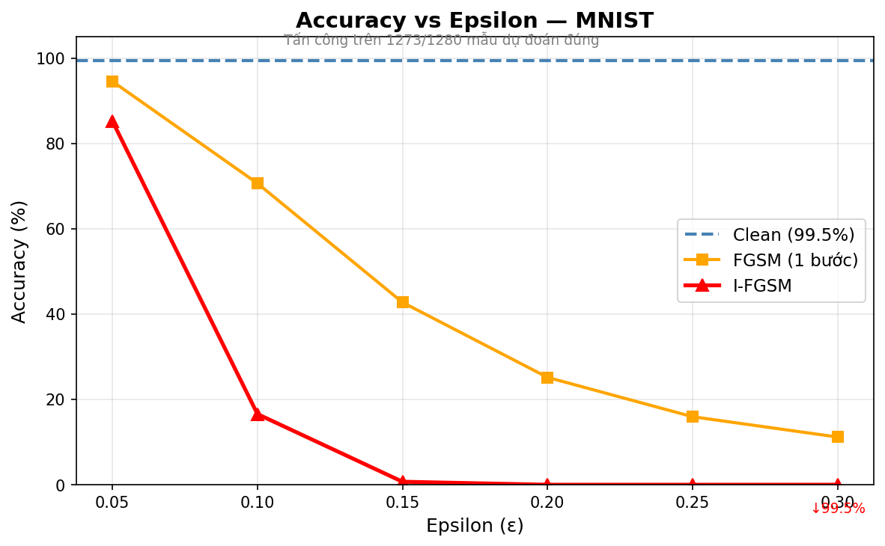

#### CIFAR-10 — 973 / 1,280 correctly classified (clean acc: 76.02%)

| ε | FGSM Acc | FGSM ASR | I-FGSM Acc | I-FGSM ASR |
|---|---|---|---|---|
| 0.05 | 21.02% | 72.4% | 7.27% | 90.4% |
| 0.10 | 15.08% | 80.2% | 1.64% | 97.8% |
| 0.15 | 12.66% | 83.4% | 1.17% | 98.5% |
| 0.20 | 12.03% | 84.2% | 0.86% | 98.9% |
| 0.25 | 11.64% | 84.7% | 0.47% | 99.4% |
| 0.30 | 11.17% | **85.3%** | 0.23% | **99.7%** |

**Key takeaways:**
- Even at `ε=0.05`, I-FGSM already achieves **90.4% ASR** — CIFAR-10 is far more vulnerable than MNIST at the same budget.
- FGSM saturates early (~85% ASR from ε=0.15 onward), confirming its single-step ceiling.
- I-FGSM at `ε=0.10` nearly matches its ε=0.30 performance (97.8% vs 99.7%) — diminishing returns from larger ε.

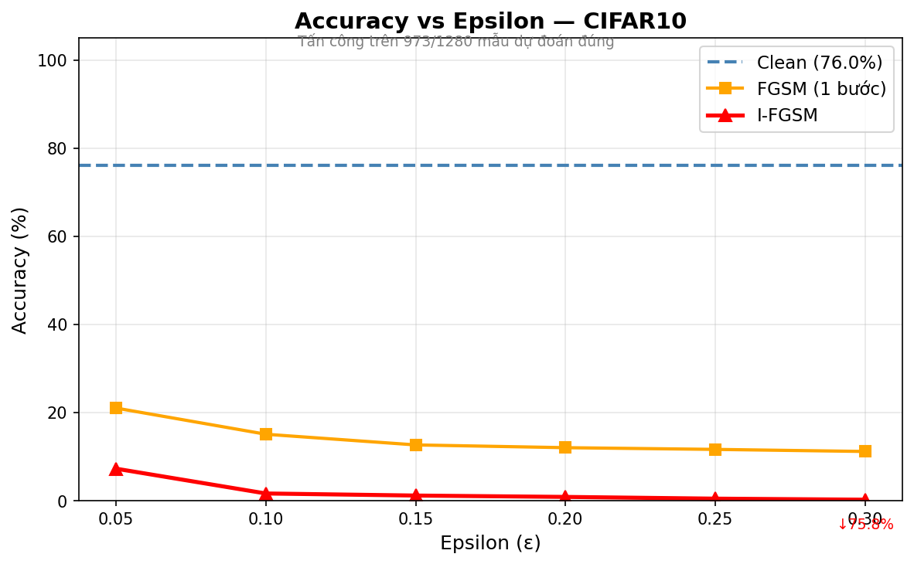

---

### Exp 2 — Accuracy & ASR vs Number of Steps (T)

Fixed: `ε=0.1` (`steps_epsilon`), evaluated on 1,280-sample subset.

#### MNIST — 1,273 correctly classified

| T | I-FGSM Acc | ASR | Accuracy Drop | Time |
|---|---|---|---|---|
| 5  | 26.64% | 73.2% | −72.81 pp | 15.7s |
| 10 | 21.25% | 78.6% | −78.20 pp | 32.5s |
| 20 | 18.20% | 81.7% | −81.25 pp | 63.8s |
| 40 | 16.56% | 83.4% | −82.89 pp | 126.4s |

**Key takeaways:**
- Attack strength increases with T but with **diminishing returns**: T=5→10 gains 5.4 pp, T=20→40 gains only 1.6 pp.
- At T=40 the attack approaches convergence — doubling steps from 20→40 gains less than 2 pp.

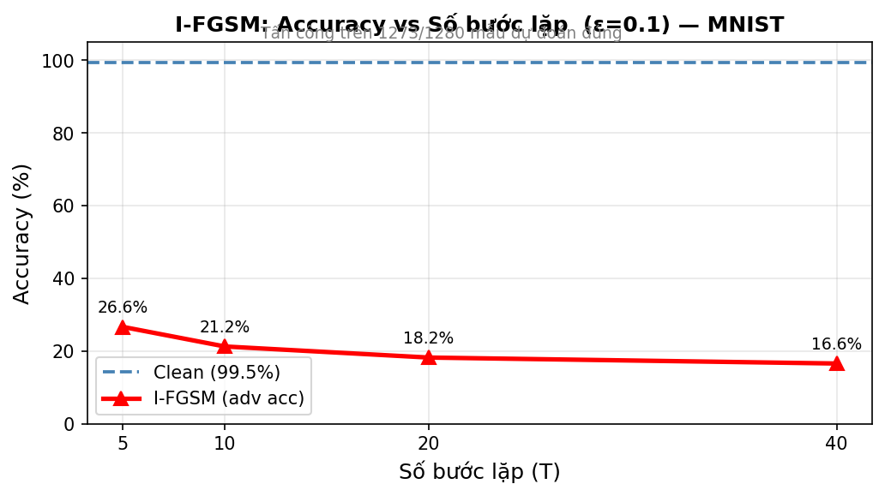

#### CIFAR-10 — 973 correctly classified

| T | I-FGSM Acc | ASR | Accuracy Drop | Time |
|---|---|---|---|---|
| 5  | 2.81% | 96.3% | −73.20 pp | 10.5s |
| 10 | 2.34% | 96.9% | −73.67 pp | 21.0s |
| 20 | 1.72% | 97.7% | −74.30 pp | 42.1s |
| 40 | 1.64% | 97.8% | −74.38 pp | 84.1s |

**Key takeaways:**
- CIFAR-10 converges **much faster** than MNIST: already 96.3% ASR at T=5 vs. 73.2% for MNIST.
- Going from T=5→40 gains only 1.5 pp on CIFAR-10 — the optimal T is effectively ≤5 for this model.
- Time scales linearly with T as expected (~10s per 5 steps on CPU).

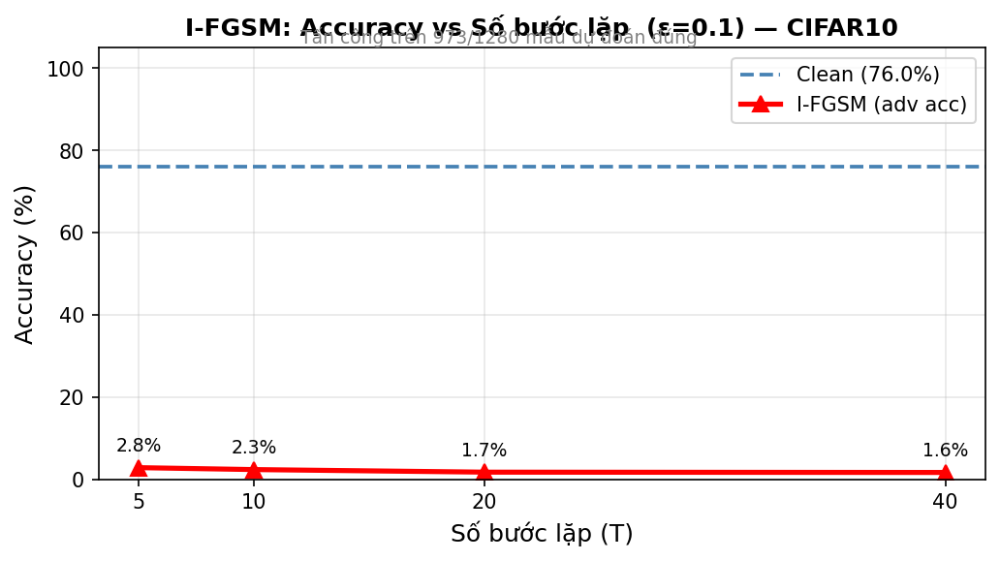

---

### Exp 3 — Adversarial Example Visualization

All visualizations are generated from correctly classified samples only.

#### MNIST

**Side-by-side comparison** — original | perturbation (×10) | adversarial:

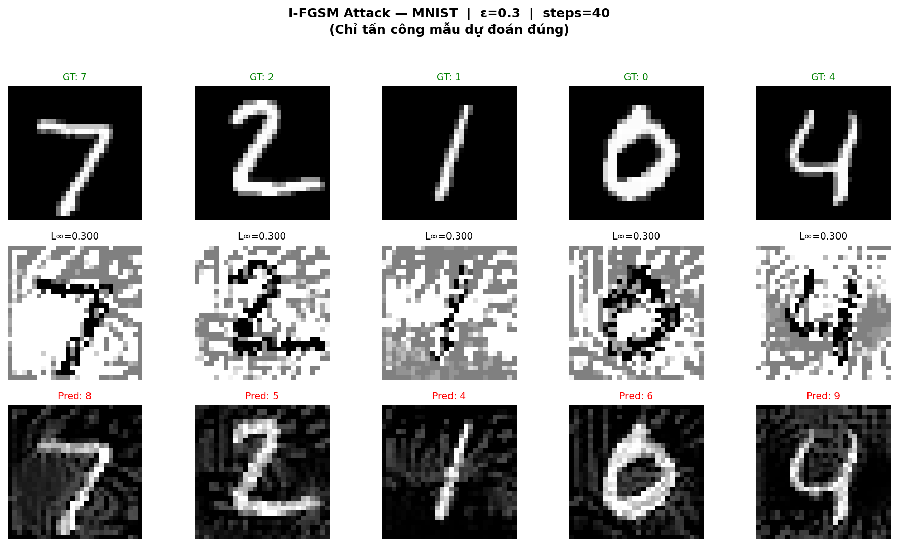

**Prediction probability bar charts** — softmax before (blue) and after (red) attack. True label outlined in black:

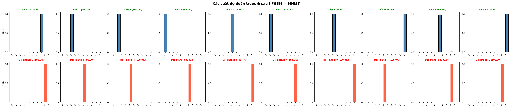

Before attack the model assigns ~100% confidence to the correct class. After, that confidence shifts entirely to a wrong class — also with ~100% certainty.

**Loss evolution** — cross-entropy rising across I-FGSM iterations:

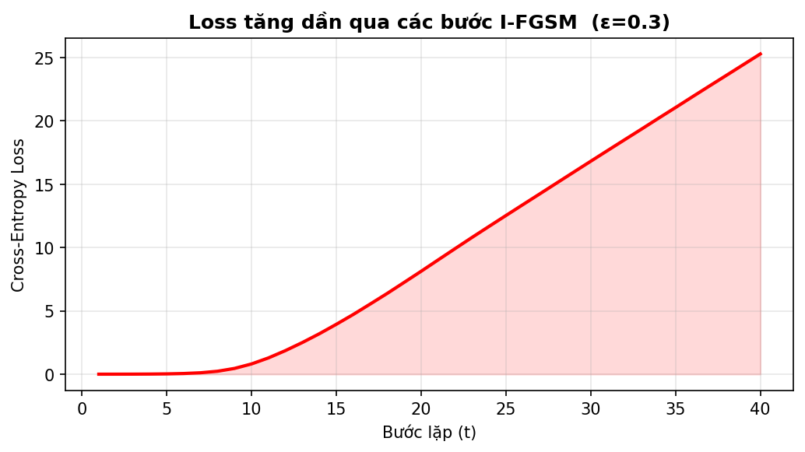

#### CIFAR-10

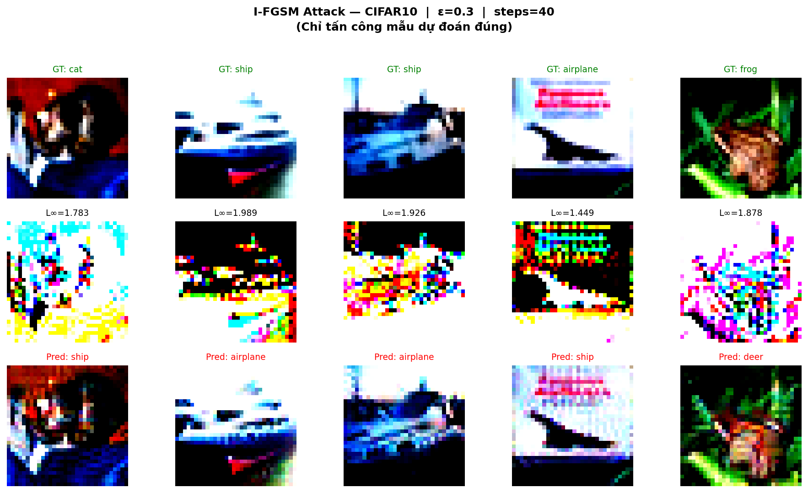

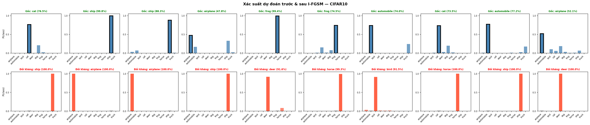

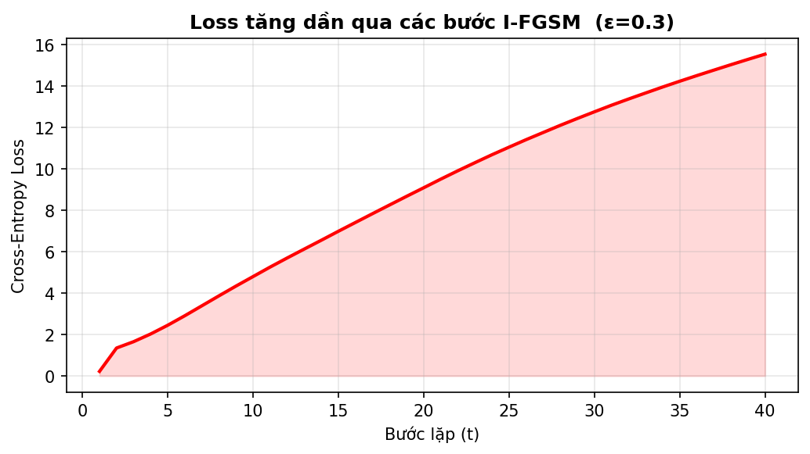

---

### Exp 4 — Presentation Grids

#### MNIST — Epsilon sweep (T=40)

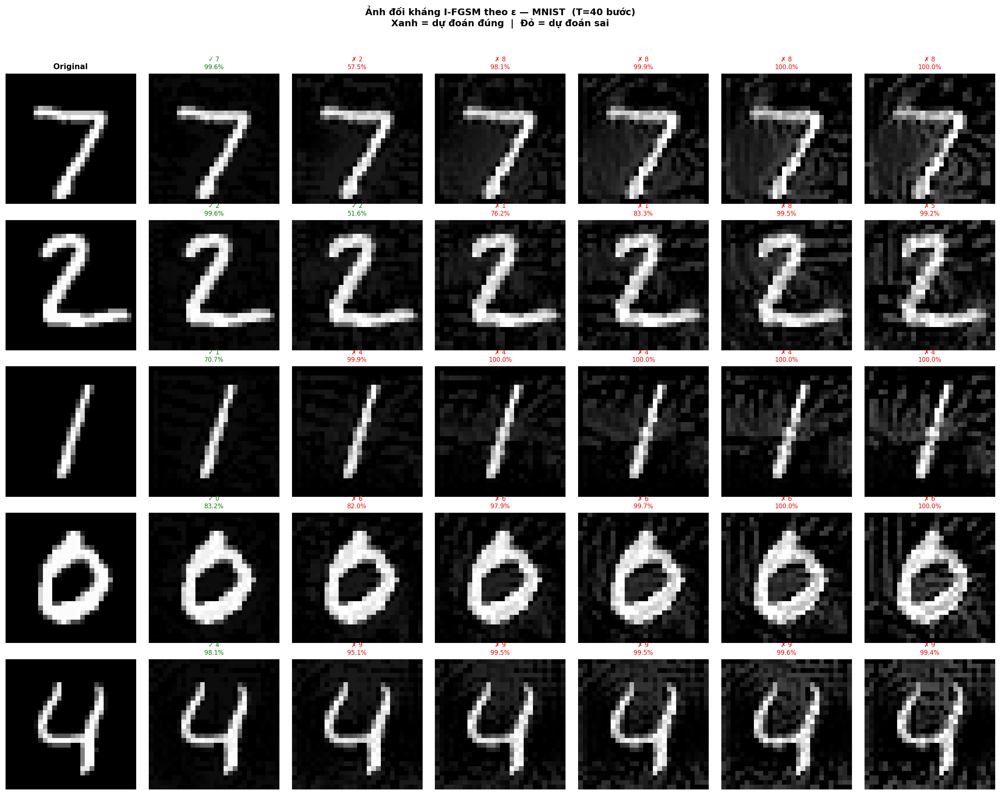

#### MNIST — Steps sweep (ε=0.1)

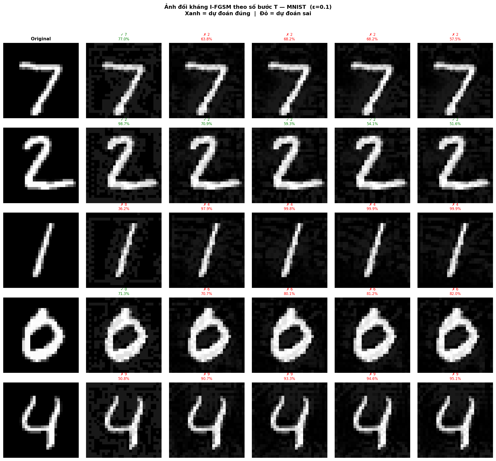

#### CIFAR-10 — Epsilon sweep (T=40)

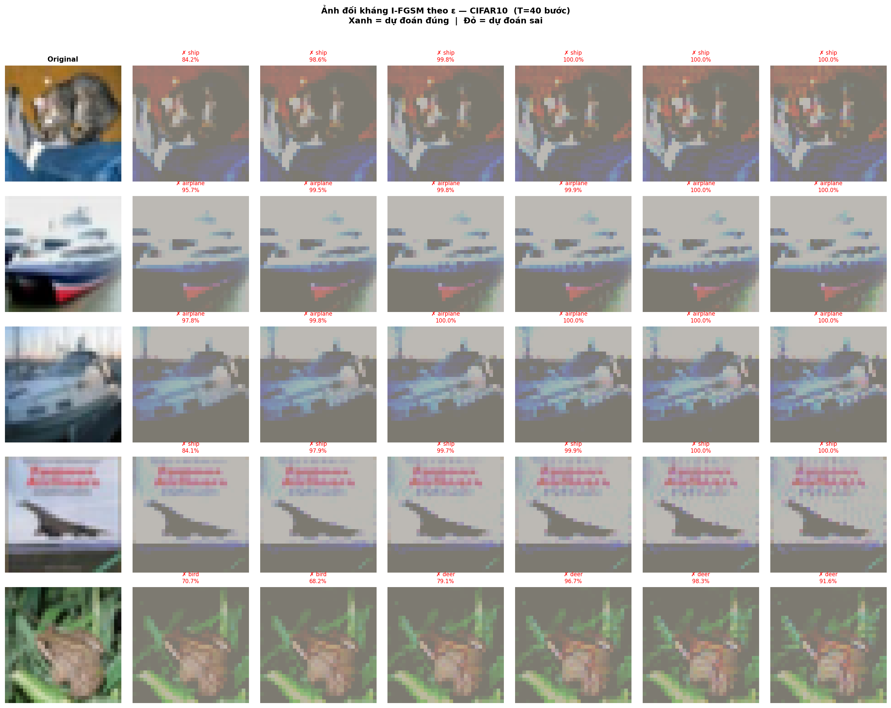

#### CIFAR-10 — Steps sweep (ε=0.1)

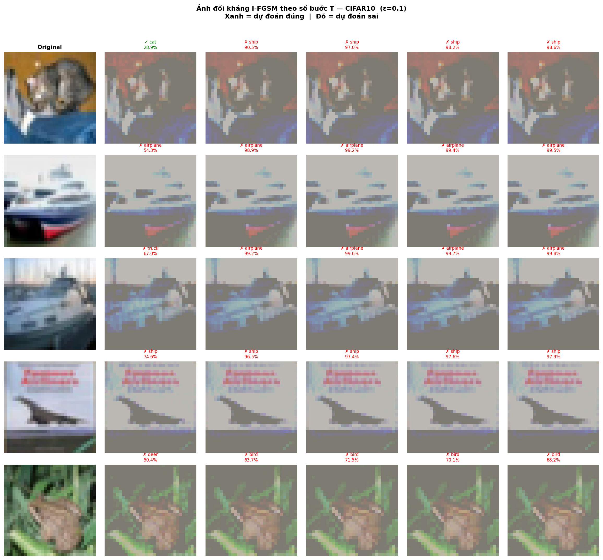

---

### Exp 5 — Cross-Architecture Transfer Attack Results

**CIFAR-10 clean accuracy by model:**

| Model | Test Accuracy |
|---|---|
| SimpleCNN | 76.02% |
| ResNet-18 | 82.00% |
| MobileNetV2 | 84.42% |

**ASR matrix at ε=0.20** — rows = source (generates adversarial examples), columns = target (evaluated on):

*FGSM:*

| Source \ Target | SimpleCNN | ResNet-18 | MobileNetV2 |
|---|---|---|---|
| **SimpleCNN** | **84.2% (WB)** | 64.1% | 73.8% |
| **ResNet-18** | 75.6% | **89.5% (WB)** | 75.3% |
| **MobileNetV2** | 74.6% | 63.9% | **81.3% (WB)** |

*I-FGSM (T=40):*

| Source \ Target | SimpleCNN | ResNet-18 | MobileNetV2 |
|---|---|---|---|
| **SimpleCNN** | **98.9% (WB)** | 67.8% | 90.4% |
| **ResNet-18** | 83.3% | **98.7% (WB)** | 87.9% |
| **MobileNetV2** | 81.8% | 66.7% | **99.3% (WB)** |

**Key takeaways:**
- White-box ASR is uniformly 98–99% for I-FGSM — all three architectures are highly vulnerable.
- Transfer (black-box) I-FGSM ASR ranges **67–90%**: a real threat even without model access.
- `SimpleCNN → MobileNetV2` achieves the highest transfer rate (90.4%); `MobileNetV2 → ResNet-18` the lowest (66.7%) due to the larger architectural gap (depthwise conv vs. residual blocks).
- FGSM transfer rates are more uniform (64–76%) than I-FGSM, suggesting single-step perturbations find more architecture-agnostic directions.

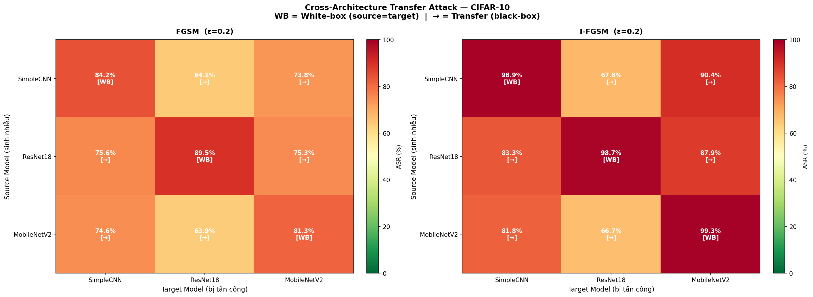

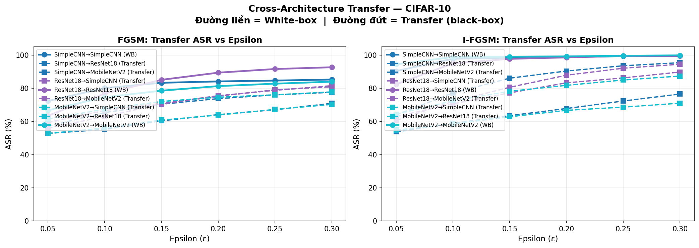

---

## Configuration

All hyperparameters are in `configs/config.yaml`. CLI flags override values without modifying the file.

```yaml
dataset:
  name: "MNIST"           # MNIST | CIFAR10 | ImageNette
  root: "./data"
  batch_size: 64
  val_split: 0.1
  num_workers: 2

model:
  name: "SimpleCNN"       # SimpleCNN | ResNet18 | MobileNetV2
                          # MobileNetV2 is only valid with ImageNette

train:
  epochs: 20
  lr: 0.001
  weight_decay: 0.0001
  optimizer: "Adam"       # Adam | SGD
  scheduler: "StepLR"
  step_size: 10
  gamma: 0.1
  save_dir: "./results/checkpoints"

attack:
  method: "ifgsm"
  epsilon: 0.3            # L∞ budget — used by Exp1 and Exp3
  alpha: null             # null → auto-computed as epsilon / num_steps
  num_steps: 40           # iterations T — used by Exp1 and Exp3
  targeted: false
  clip_min: 0.0           # used for MNIST/CIFAR-10; overridden automatically for ImageNette
  clip_max: 1.0

experiment:
  epsilon_list: [0.05, 0.1, 0.15, 0.2, 0.25, 0.3]
  steps_list: [5, 10, 20, 40]
  steps_epsilon: 0.1      # epsilon used ONLY by Exp2 — smaller to avoid early saturation
  seed: 42
  device: "cuda"          # cuda | cpu | mps
  num_samples: 1000

vis:
  num_examples: 10
  save_dir: "./results/figures"
  dpi: 150
```

### CLI flags

| Flag | Values | Effect |
|---|---|---|
| `--dataset` | `MNIST` / `CIFAR10` / `ImageNette` / `both` | Override dataset |
| `--model` | `SimpleCNN` / `ResNet18` / `MobileNetV2` | Override model architecture |
| `--skip-train` | — | Skip training, load existing checkpoint |
| `--exp` | e.g. `1 3` | Run only the specified experiments |
| `--epochs` | int | Override number of training epochs |
| `--lr` | float | Override learning rate |
| `--batch` | int | Override batch size |

> **`--model` propagation**: when passed to `main.py`, the flag is forwarded to both `train.py` (for training) and all experiment `run()` functions (for loading the correct checkpoint). You do not need to edit `config.yaml` to switch between ResNet-18 and MobileNetV2.

### `steps_epsilon` explained

Exp2 sweeps over step count `T`. Using `attack.epsilon = 0.3` makes even 5 steps reduce accuracy to ~0%, making the chart meaningless. `steps_epsilon: 0.1` keeps the attack in a range where each additional step still produces a visible difference.

---

## Testing

Tests run on CPU with a random `SimpleCNN` — no checkpoint or GPU required.

```bash
python -m pytest tests/ -v
```

| Test class | Coverage |
|---|---|
| `TestIFGSMAttack` | Shape, L∞ bound, pixel range `[0,1]`, no gradient leakage, `last_stats` keys, auto-alpha, custom clip range, `__repr__` |
| `TestIfgsmFunction` | Functional API matches class API (same seed), output shape |
| `TestFGSMBaseline` | Shape, L∞ bound |
| `TestSimpleCNN` | MNIST and CIFAR-10 output shapes `[B, 10]` |

---

## References

| Paper | Link |
|---|---|
| FGSM — Goodfellow et al. (2015) | https://arxiv.org/abs/1412.6572 |
| **I-FGSM / BIM** — Kurakin et al. (2016) | https://arxiv.org/abs/1607.02533 |
| PGD — Madry et al. (2018) | https://arxiv.org/abs/1706.06083 |
| MI-FGSM — Dong et al. (2018) | https://arxiv.org/abs/1710.06081 |
| DI-FGSM — Xie et al. (2019) | https://arxiv.org/abs/1803.06978 |
| Transferability — Papernot et al. (2016) | https://arxiv.org/abs/1605.07277 |
| MobileNetV2 — Sandler et al. (2018) | https://arxiv.org/abs/1801.04381 |
